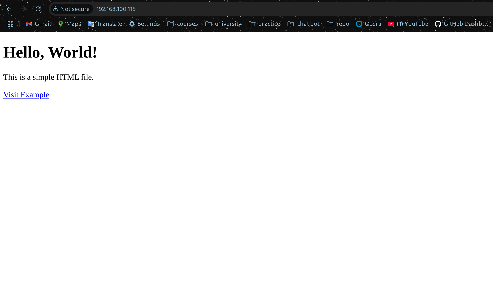

# 1) install nginx

# 2) serve a static site with nginx

# 3) reverse proxy

# 4) Load Balancing

از round-robin استفاده کردم که ملموس تر باشه توی مثال ساده که چطور بین سرور ها سوییچ انجام میشه.

و اینکه با اینکه می بردم توی بک گراند دو تا بک اند را نشد که دوتاش روی یه ماشین باشه و درست نمی شد سوییچ بینشون(نمی دونم چرا :))
برای همین یکیش را روی اوبونتو سرور و یکی را روی سیستم خودم ران کردن و ایپی سیستمم را به عنوان یکی از سرورها دادم.

# 5) Authentication

